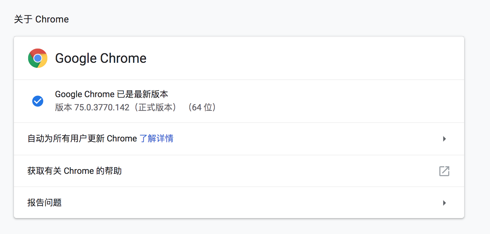
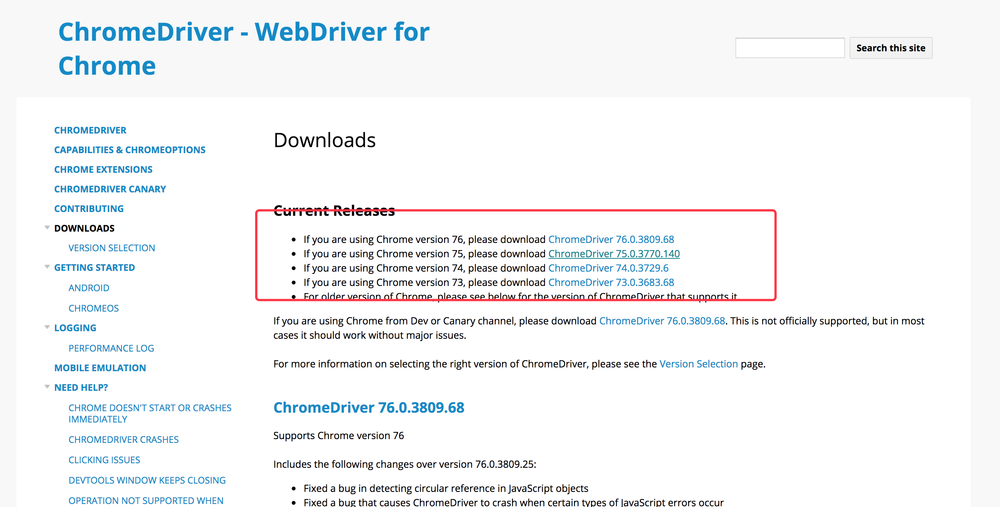
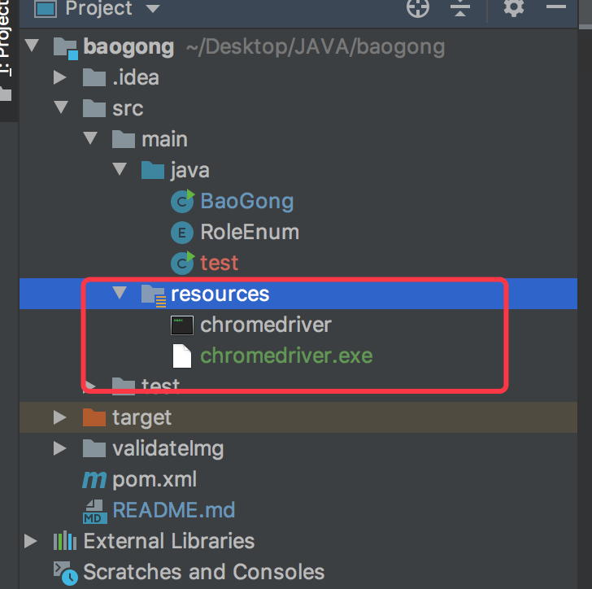
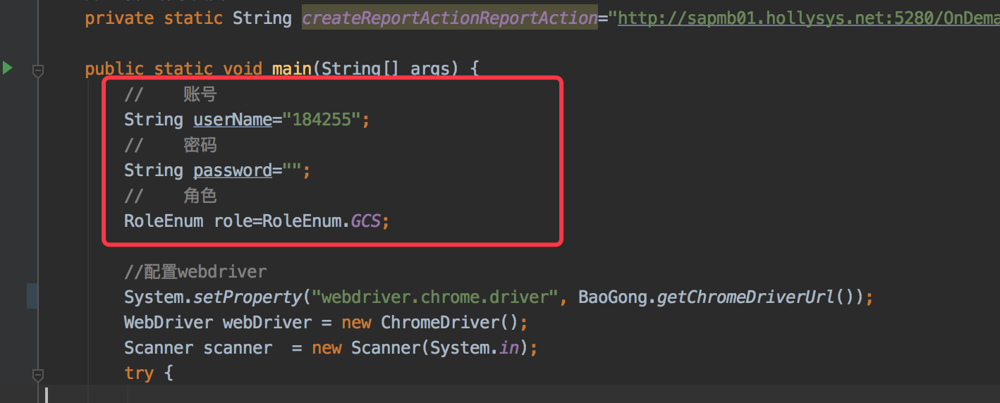
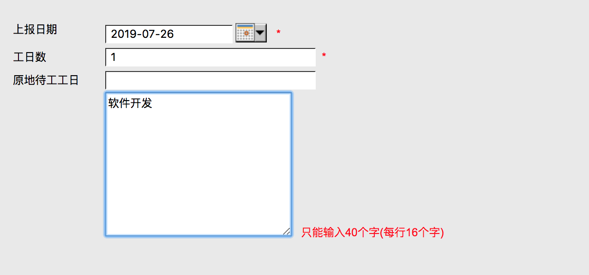
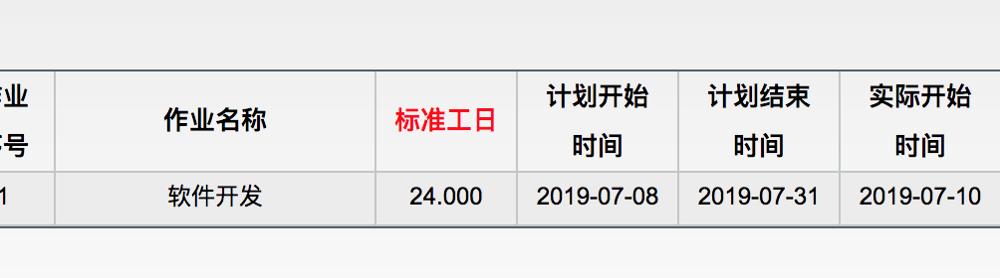
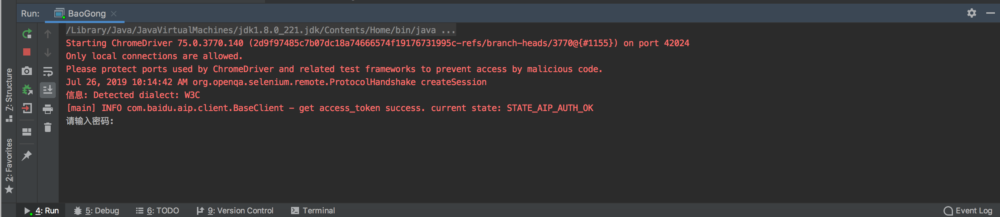
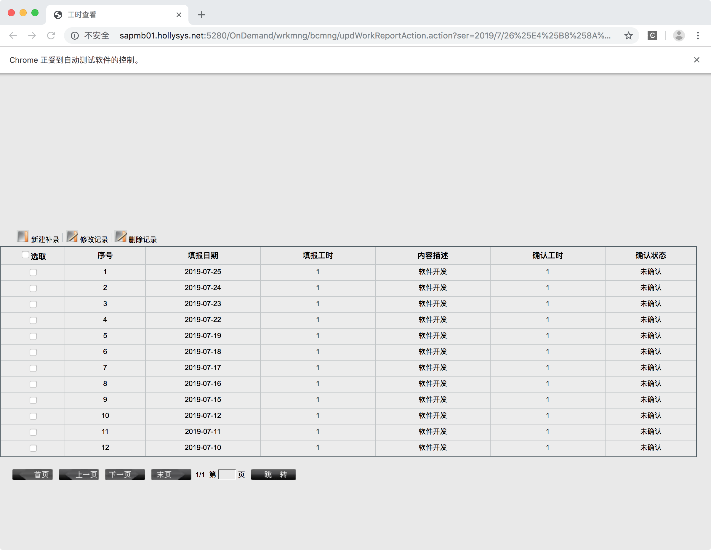
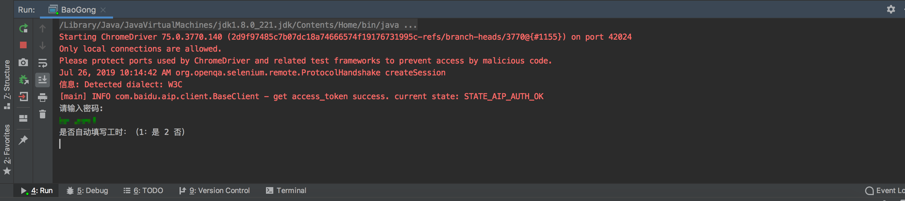
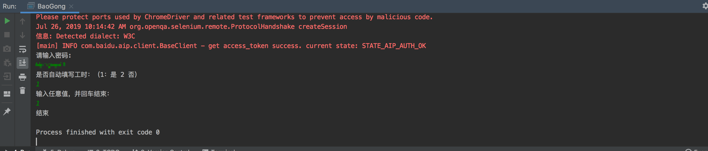

# baogong
内部自动化报工，解决繁琐的操作

- 解决ie浏览器及版本的限制
- 自动化登录
- 自动填报工时

## 配置及准备工作说明

1. 下载并导入项目

2. 下载google浏览器，并根据google版本，下载相应的ChromeDriver

   - 版本查看：

     

   - ChromeDriver下载地址：

     http://chromedriver.chromium.org/downloads

   - 下载完成后将chromedriver.exe（windows）或chromedriver（mac）放入resources路径下（如图示），项目默认提供：mac 75版本和windows 74版本的chromedriver。

3. 配置登录账号、密码、角色

   项目》src》main》java》baogong.java>main

   

## 操作说明

> **必读**：
>
> * 登录的验证识别使用的是百度的文字识别服务，可能存在验证码识别失败导致页面直接退出的情况，目前没有加容错处理，重新运行代码即可。
>
> * 工时填报的内容：
>
>   
>
>   - 上报日期为当天
>   - 工日数：1
>   - 备注为任务的作业名称：如下
>
>   

1. 登录vpn

2. 执行baogong.java main方法，会自动打开chrome浏览器，访问报工首页

3. 如果未在代码中配置账号密码，需填写用户名密码

   

4. 填写完毕后，回车，页面自动跳转到工时查看页。

   

5. 控制台根据提示输入：1

   

6. 会根据派发的任务自动填报**当天**工时,填报完成后，跳转回工时查看页，可查看对已填报工时。

7. 控制台中输入任意值，并回车退出

   ]